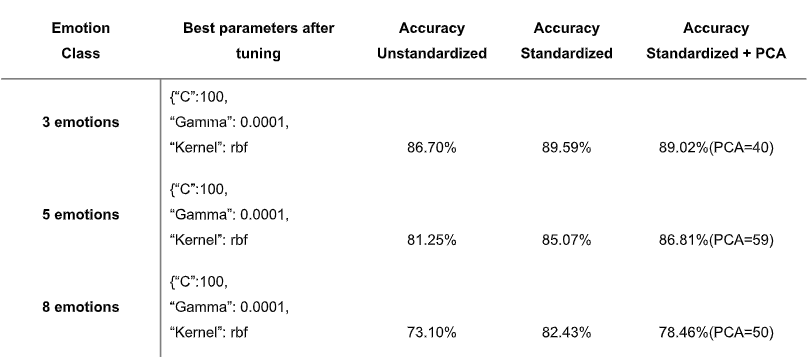

# Speech-Emotion-Classification


## step 1: git clone project
```
git clone https://github.com/Jason-Oleana/Speech-Emotion-Classification.git
```

## step 2: Navigate to Speech-Emotion-Classification
```
cd Speech-Emotion-Classification
```

## Step 3: install all requirements

```
pip install -r requirements.txt
```

## step 4: Download RAVDESS-RawData
```
https://drive.google.com/drive/folders/1S3j7CkyGWDpjS6OMSGOL0ka_osKff_Vg?usp=sharing

Reference:
- Livingstone SR, Russo FA (2018) The Ryerson Audio-Visual Database of Emotional Speech and Song (RAVDESS): A dynamic, multimodal set of facial and vocal expressions in North American English. PLoS ONE 13(5): e0196391. https://doi.org/10.1371/journal.pone.0196391
```

## step 5: Update my_path to RAVDESS-RawData in the .ipynb project
```
my_path = "your path to Ravdess-RawData"
```

## step 6: You can run the code :)

### Accuracy rate of SVM with MFCC features

```
3 emotions = happy, sad, neutral
5 emotions = happy, angry, neutral, sad, and fearful
8 emotions = happy, angry, neutral, sad, fearful, disgust, calm, surprised
```


### Confusion matrix: best-performing SVM classifier (three emotions) with MFCC features


### Confusion matrix: best-performing SVM classifier (five emotions) with MFCC features


### Confusion matrix: best-performing SVM classifier (eight emotions) with MFCC features

 

### Mel frequency cepstral coefficients (MFCCs)
Mel frequency cepstral coefficients are the most widely used speech feature for SER. 
Mel Frequency Cepstral Coefficients are derived from the cepstrum, which is the inverse spectral transform of the logarithm of the spectrum. 
They concisely describe the overall shape of a spectral envelope

### Findings and limitations
A noticeable result was in the emotions that achieved the lowest performance: happy, disgust, sadness, and anger. 
These emotions were the most difficult to distinguish for both the Log-Gabor conditions and the MFCC conditions. 
A reason for the lower performance could be that disgust, anger, and sadness fall under the unpleasant range of valence. 
According to research on the vocal communication of emotion conducted by Scherer (2003), emotions with a similar valence are often confused with one another, and can therefore be harder for a machine learning algorithm to classify.

A limitation of this research is that the dataset consisted of acted emotions recorded by professional actors. 
According to Gupta & Rajput (2007), the stress on various emotions is not significant when customers express long sentences. 
In another study on the relationship between lexical and prosodic emotional cues in English (Mairano, Zovato & Quinci, 2019), the researchers indicated that speech voiced by professional actors tends to be overacted. For this reason, acted emotions do not correspond to the natural flows found in spontaneous speech (Scherer, 2013). 
Furthermore, a multimodel algorithm could be proposed in order to handle acoustic features and converting speech to text for sentiment analysis from real conversation. A combination of acoustic features and sentiment analysis from text could increase the accuracy of speech emotion classification algorithms.

### Speech feature categorization according to their temporal structure (suprasegmental vs. segmental) and parameterization (LLDs vs. functionals).


## Ideas 

- Data Augmentation (CNN needs more data for better training)
- Concatenate other speech features
- Concatenate other datasets for more training data

## Literature

- Scherer, Klaus R. "Vocal communication of emotion: A review of research paradigms." Speech communication 40.1-2 (2003): 227-256.
- Gupta, P., & Rajput, N. (2007). Two-stream emotion recognition for call center monitoring. In Eighth Annual Conference of the International Speech Communication Association. 
- Mairano, P., Zovato, E., & Quinci, V. (2019). On the relation between lexical and prosodic cues of emotion in English: a preliminary corpus-based analysis. Anglophonia.
